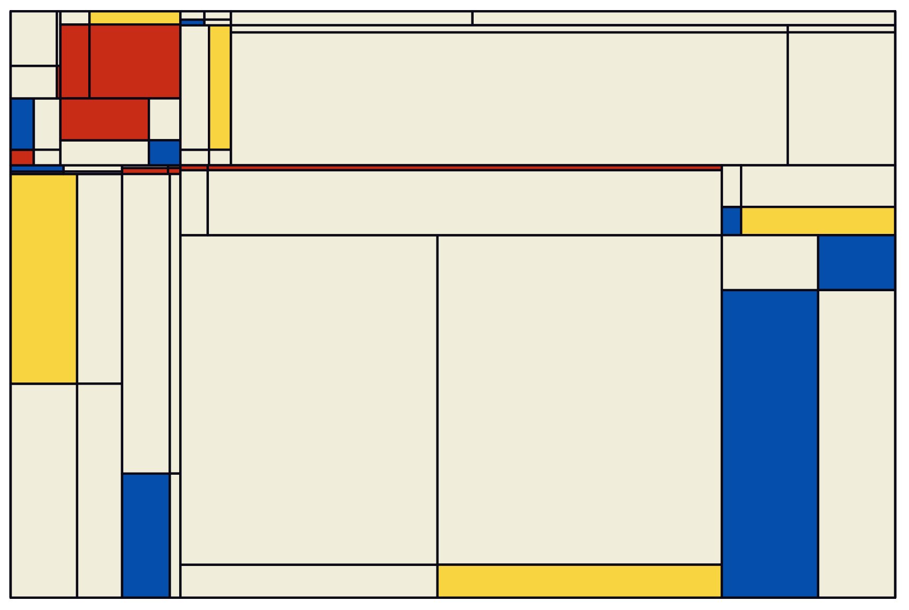

# mondrianaRt

<!-- badges: start -->
[](https://www.tidyverse.org/lifecycle/#experimental)
[](https://github.com/js2264/mondrianaRt/actions)
<!-- badges: end -->

## Quick use 

```r
library(mondrianaRt)
`%>%` <- magrittr::`%>%`
tileSet() %>% plotTiles()
```



## Art customization 

```r
tileSet() %>% plotTiles()
```

The ratio of the plot is controlled by the `ratio` argument (`1` by default, i.e. a square plot). 

```r
tileSet(ratio = 1/3) %>% plotTiles()
```

How "deep" the plot is (i.e. how recursive the internal loop is) is controlled by the `levels` argument (`4` by default).

```r
tileSet(levels = 10) %>% plotTiles()
```

By default, some tiles are randomly split in 2 (either vertically or horizontally), rather than in 4. This is controlled by the `filter` argument (`TRUE` by default).

```r
tileSet(levels = 10, filter = FALSE) %>% plotTiles()
```

One can also control the minimum stretch (both horizontally and vertically) of each tile. By default, this ensures that the tiles are somewhat consistent. This can be reduced/increased with the `min.stretch` argument (`0.04`, or 4% by default)

```r
tileSet(levels = 10, filter = FALSE, min.stretch = 0.01) %>% plotTiles()
```

This option can also be deactivated by using `min.stretch = 0`. This leads to a large increase of tiles, since they are all considered valid !

```r
tileSet(levels = 10, filter = FALSE, min.stretch = 0) %>% plotTiles()
```

## Many plots at once

```r
lapply(1:30, function(seed) {
    message(seed)
    ratio <- sample(seq(0.5, 1.5, by = 0.1), 1)
    level <- sample(1:4, 1)
    whites <- sample(seq(0.2, 0.8, by = 0.1), 1)
    p <- tileSet(ratio = ratio, levels = level, seed = seed) %>% plotTiles(white.density = whites)
    ggplot2::ggsave(glue::glue('mondrian_seed-{seed}.png'), w = 10, h = 10*ratio)
})
```

## Acknowledgments

I got some inspiration from the previous attempts to reproduce/enhance the art style from Piet Mondrian:

* https://github.com/nvdv/mondrianify  
* https://github.com/kmcelwee/mondrianify  
* https://github.com/yanhann10/mondrianify  
* https://www.cs.cornell.edu/courses/cs1110/2016sp/lectures/04-19-16/21.RecursionH.pdf  
* https://github.com/anvaka/city-script